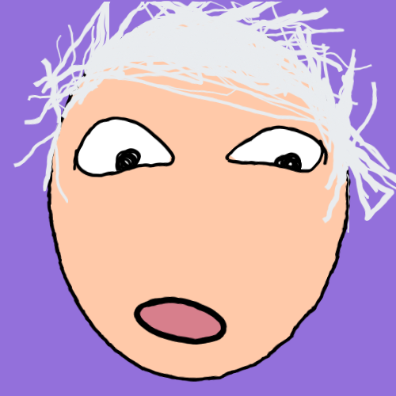
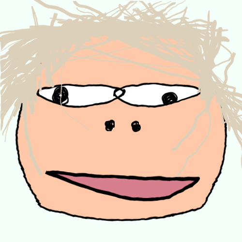

# ugly-avatar

An ugly avatar generator — every face is derived from its seed, so the same seed always renders the same face.

## Gallery

A few faces generated by this repository, each seeded with a fixed string:

|                                                                                       |                                                                                    |                                                                                   |
| ------------------------------------------------------------------------------------- | ---------------------------------------------------------------------------------- | --------------------------------------------------------------------------------- |
|                             |                            |                             |
|                                 |                                |                         |

## Live demo

Visit the website: https://angrylid.github.io/ugly-avatar

## Use as a package

The generator ships on npm as `uglymug` — a framework-agnostic library built from this same source, so the package and the website always render identical faces for a seed.

```bash
npm install uglymug
```

```js
import { generateFaceSVG, generateFaceDataURL, generateFacePNG, randomSeed } from "uglymug";

const seed = randomSeed();
const svg = generateFaceSVG(seed);               // '<svg ...>...</svg>'
const b64 = generateFaceDataURL(seed);           // 'data:image/svg+xml;base64,...' for 
const png = await generateFacePNG(seed, { size: 512 }); // browser-only canvas rasterization
```

Options: `{ size, transparent }` — `size` sets the SVG width/height (default 500), `transparent: true` drops the background rect. You can also generate the raw data and render it yourself: `generateFaceData(seed)` plus `faceDataToSVG(face, opts)`.

### Vue 3

```js
import { useUglyFace } from "uglymug/vue";

const { seed, svg, dataUrl, regenerate, setSeed } = useUglyFace();
```

```html
<div v-html="svg"></div>
<!-- or -->

<button @click="regenerate">ANOTHER</button>
```

`useUglyFace` also accepts a string, a ref, or a getter as the initial seed, and `setSeed(s)` loads a specific seed.

### React

The core API is plain functions, so a hook is one line:

```js
const svg = useMemo(() => generateFaceSVG(seed), [seed]);
```

### Node

`generateFaceSVG` and `generateFaceDataURL` work in Node out of the box. `generateFacePNG` needs a browser canvas; in Node, rasterize the SVG string yourself, e.g. with [resvg-js](https://github.com/yisibl/resvg-js):

```js
import { Resvg } from "@resvg/resvg-js";
import { generateFaceSVG } from "uglymug";

const png = new Resvg(generateFaceSVG(seed), { fitTo: { mode: "width", value: 512 } })
  .render()
  .asPng();
```

### Types & builds

TypeScript declarations are included; both ESM and CJS builds ship in `lib/`. `vue` is an optional peer dependency — only needed for `uglymug/vue`.

Note: the older npm packages `ugly-face` and `ugly-avatar` are unofficial third-party ports; `uglymug` is the official package built from this repository.

### Development (this repository)

```bash
npm install
npm run serve       # demo app
npm run build       # build the demo
npm run build:lib   # build the npm package into lib/
npm test            # run the library tests
```

## Credits

This repository is a fork of [ugly-avatar](https://github.com/txstc55/ugly-avatar) by **Xuan Tang ([@txstc55](https://github.com/txstc55))**. All credit for the original face generator goes to the original author — thank you for sharing this project with the world.

This work inherits the [Attribution-NonCommercial 4.0 International](./LICENSE) license from the original project: non-commercial use only, with attribution to the original creator preserved.
